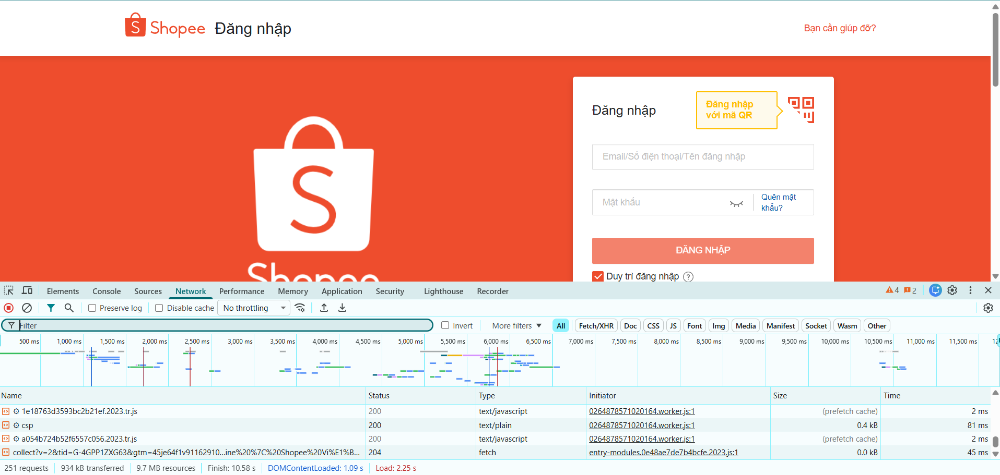

1.Khi bạn gõ https://shopee.vn vào trình duyệt và nhấn Enter, hãy liệt kê đúng thứ tự ít nhất 5 bước xảy ra (từ DNS lookup đến render).
Trả lời :
1. DNS Lookup : trình duyệt sẽ hỏi dns server : shopê.vn là gì => nhận địa chỉ ip của server
2. Thiết lập kết nối (TCP + TLS) : tạo kết nối với tcp là server , nếu là https -> thêm bước tls handshake để mã hóa bảo mật
3. Gửi HTTP Request : gửi rq đến server shopee
4. Server xử lý : Server nhận rq -> xử lý logic (lấy dữ liệu , render html , gọi db,..)
5. Server trả http response : trả về html , css ,js , ...
6. Browser tải thêm tài nguyên : trình duyệt tiếp tục gửi nhiều rq khác để tải : css , js , ảnh ( khoảng 50-100 rq)
7. Browser Rendering : 
- Parse HTML -> Tạo DOM
- Parse CSS
- Execute JS
- Paint & Render -> hiển thị trang web
2.Trong DevTools của Chrome, tab Network cho thấy thông tin gì? Hãy mở một trang web bất kỳ, chụp screenshot tab Network và đánh dấu (vẽ mũi tên/khoanh tròn) vào:
-Status Code của request đầu tiên
-Tổng thời gian load trang
-Một request trả về file CSS
Trả lời : 

Status Code của request đầu tiên : Status = 200
Tổng thời gian load trang : Finish: 10.58 s
Một request trả về file CSS : 8434.0c54badf654b474e.2023.css
-> Đây là request trả về file CSS
Câu A2 (5đ) — Semantic HTML
Đọc chương 04, trả lời: Tại sao trang web dưới đây bị Google đánh giá SEO thấp? Liệt kê ít nhất 4 lỗi semantic và sửa lại.

    
ShopTLU

    

        
<a href="/">Trang chủ</a>

        
<a href="/products">Sản phẩm</a>

    

    

        
iPhone 16 Pro

        
25.990.000đ

        

    

© 2026 ShopTLU

Trả lời :
Tại sao trang web bị SEO thấp vì :

- Trang web sử dụng quá nhiều thẻ 
 không có ý nghĩa khiến:
+,Google không hiểu cấu trúc trang
+,Không biết đâu là header, nội dung chính, sản phẩm...
+,SEO kém (đúng như chương 4 nói: dùng sai thẻ = Google không hiểu nội dung)
- Các lỗi semantic :
Lỗi 1: Dùng 
 thay vì <header>
Không thể hiện đây là phần đầu trang
Lỗi 2: Menu không dùng <nav>

Lỗi 3: Nội dung chính không dùng <main>

Lỗi 4: Sản phẩm không dùng <article>

Lỗi 5: Không dùng <section> để nhóm nội dung
Không chia rõ khu vực nội dung

Câu A3 (5đ) — Block vs Inline
Không chạy code, hãy vẽ tay (hoặc mô tả bằng text art) kết quả hiển thị của đoạn HTML sau. Giải thích tại sao.

Hộp 1

Text A
Text B

Hộp 2

Text C
<strong>Text D</strong>

Hộp 3

Trả lời :

-
 là **block element** → chiếm toàn bộ 1 dòng → luôn xuống dòng.
- và <strong> là **inline element** → chỉ chiếm nội dung → nằm cùng dòng.

- 
Hộp 1
 → hiển thị riêng 1 dòng  
- Text A Text B → cùng dòng → "Text A Text B"  
- 
Hộp 2
 → xuống dòng  
- Text C <strong>Text D</strong> → cùng dòng → "Text C Text D"  
- 
Hộp 3
 → xuống dòng  

=>

- Block element → xuống dòng  
- Inline element → nằm cùng dòng

Câu A4 (5đ) — Table
Đọc chương 05. Giải thích sự khác nhau giữa <thead>, <tbody>, <tfoot>. Tại sao KHÔNG NÊN dùng table để tạo layout trang web? (Ghi rõ ít nhất 3 lý do)
Trả lời : 
- <thead> là phần đầu của bảng , chứa tiêu đề các cột 
- <tbody> là phần thân bảng , chứa dữ liệu chính
- <tfoot> là phần cuối bảng , hiển thị thông tin tổng kết
2. Tại sao k nên dùng <table> để layout trang web
LD1 : Sai semantic ( ý nghĩa html )
- <table> chỉ nên dùng cho dữ liệu bảng
- Dùng layout sẽ làm sai ý nghĩa -> ảnh hưởng SEO , google khó hiểu cấu trúc trang
LD2 : Khó responsive
- Table có cấu trúc cứng, khó co giãn trên nhiều kích thước màn hình.
- Khi hiển thị trên mobile dễ bị vỡ layout.
ld3 : Code phức tạp, khó bảo trì
- Phải dùng nhiều thẻ <tr>, <td> lồng nhau.
- Code dài, khó đọc, khó sửa.
LD4 : Hiệu năng kém hơn
- Trình duyệt phải load toàn bộ bảng rồi mới render.
- Kém tối ưu hơn so với layout bằng CSS (Flexbox, Grid).

Bài 3 : Debug HTML
Lỗi 1 : Dòng 1 <!DOCTYPE> viết chưa đầy đủ  - Sửa lại thành <!DOCTYPE html>
Lỗi 2 : Dòng 2 thẻ <html> thiếu thuộc tính ngôn ngữ - sửa lại <html lang="vi">
Lỗi 3 : Dòng 4 thẻ <title> chưa đóng - sửa lại : </title>
Lỗi 4 : Dòng 5 - giá trị charset chưa đúng - sửa lại "utf8" thành "UTF-8"
Lỗi 5 : Dòng 8 - thẻ <h1> đóng sai cú pháp - sửa lại : </h1> 
Lỗi 6 : Dòng 12 - thẻ <a> đóng sai cú pháp - sửa lại : </a>
Lỗi 7 : Dòng 12 - Gía trị href="home" chưa rõ đích đến - sửa lại : thêm đích đến hoặc để "#"
Lỗi 8 : Dòng 13 - Giá trị href="products" chưa rõ đích đến - sửa lại : thêm đích đến hoặc để "#"
Lỗi 9: Dòng 19 — Thẻ  thiếu dấu ngoặc kép ở thuộc tính src — Sửa lại: src="iphone.jpg"
Lỗi 10: Dòng 19 — Thẻ  thiếu thuộc tính alt — sửa lại : thêm alt="iPhone 16 Pro"
Lỗi 11: Dòng 18 — Dùng <h3> chưa hợp lý vì đây là tiêu đề chính của section — Sửa lại <h2>
Lỗi 12: Dòng 21 — Thẻ 
 và <b> lồng sai thứ tự — Sửa lại: 
Giá: <b>25.990.000đ
</b> thành 
Giá: <b>25.990.000đ</b>

Lỗi 13: Dòng 27–28 — Hàng tiêu đề bảng đang dùng <td> thay vì <th> — Sửa lại : dùng <th>
Lỗi 14: Dòng 41 — Thẻ 
 trong footer chưa được đóng — Sửa lại 
Copyright 2026

Bài 4 : Phân tích trang web thật ( chọn thế giới di động )

1 . Chụp screenshot tab Elements, chỉ ra ít nhất:

3 thẻ semantic HTML5 mà trang đó sử dụng (ghi rõ thẻ gì, ở đâu) 
Trả lời :
1. Thẻ <header>
Vị trí : <header class="header v2024 theme-reunification hasbanner" ...></header>
2. Thẻ <body>
Vị trí : <body class="theme-reunification">
3. Thẻ <noscript>
Vị trí : <noscript></noscript>

2 thẻ mà trang đó KHÔNG dùng đúng semantic (nếu có)
Trả lời : 
1. Dùng thẻ 
 thay cho <nav>

 => đây là menu điều hướng nhưng k dùng <nav> sửa lại nên dùng <nav>...</nav>
2. Dùng 
 thay cho <section> hoặc <main>

 => đây là nd chính nhưng lại k dùng section hoặc main => SEO kém , khó đọc

Mở tab Elements, tìm 1 <table> trên trang. Chụp screenshot và trả lời:

Table đó hiển thị nội dung gì?
Có dùng <thead>, <tbody> không?

Trả lời : Sau khi mở tab elements và dùng chức năng tìm kiếm với từ khóa <table> , em k tìm thấy thẻ <table> nào trên trang sản phẩm tgdd đã chọn
Website chủ yếu sử dụng các thẻ 
 , <a> , 
 ,  , ... kết hợp với css để dàn bố cục và hiển thị thông tin.
Có dùng <thead>, <tbody> không?
Trả lời : Không vì k có thẻ <table> => k có <Thead> và <tbody>

Tìm 1 <form> trên trang (ví dụ ô tìm kiếm). Chụp screenshot:

Form đó có action và method gì?
Input types nào được dùng?

Trả lời :  Vị trí:
Form nằm trong phần header của trang (thanh tìm kiếm)
<form action="/tim-kiem" onsubmit="return suggestSearch(event);" class="header__search">
action : /tim-kiem
method : k khai báo => dùng mặc định get
Input types sử dụng : <input id="skw" type="text" ... name="key">
<button type="submit"></button>

Câu C2:   Một đồng nghiệp nói: "Dùng 
 cho mọi thứ rồi thêm class là được, không cần semantic HTML. Tốn thời gian học thêm thẻ mới."

Viết 1 đoạn phản biện (200-300 từ), phải bao gồm:

Ít nhất 2 lý do kỹ thuật (SEO, Accessibility)
1 ví dụ cụ thể chứng minh semantic HTML giúp ích
1 trường hợp thực tế mà 
 vẫn phù hợp

Trả lời : Theo em , quan điểm dùng 
 cho mọi thứ có thể nhanh lúc đầu nhưng về kĩ thuật thì có vẻ chưa đc tối ưu . Về SEO , các công cụ tìm kiếm như google ko chỉ đọc nội dung mà còn ptich cấu trúc trang . Nếu ta dùng <header> , <nav> , <main> , ... thì bot nó sẽ hiểu rõ chỗ nào là nội dung chính , đâu là menu hay là footer còn nếu mà dùng nguyên 
 thì cấu trúc sẽ mơ hồ , giảm hiệu quả SEO
Thứ hai là về Accessibility , semantic HTML hỗ trợ các công nghệ như screen reader. Ví dụ, khi dùng <nav>, trình đọc màn hình sẽ thông báo “navigation region”, giúp người khiếm thị dễ điều hướng. Nếu dùng 
, công cụ hỗ trợ sẽ không hiểu ý nghĩa đó → trải nghiệm kém hơn.
Ví dụ cụ thể: một trang blog. Nếu bài viết được bọc trong <article> và tiêu đề dùng <h1>, công cụ tìm kiếm sẽ nhận diện đây là nội dung chính. Điều này giúp SEO tốt hơn và người dùng dễ tiếp cận hơn, so với việc chỉ dùng 
.
Tuy nhiên thì 
 vẫn rất cần thiết trong thực tế . Nó phù hợp khi mà ta cần 1 container thuần để layout hoặc styling kiểu như chia grid , flexbox hoặc nhóm các phần tử có ý nghĩa cụ thể . Khi đấy thì dùng 
 là đúng
Chung quy lại thì sematic html k phải là tốn tgian mà là dùng để code rõ ràng , thân thiện và dễ bảo trì